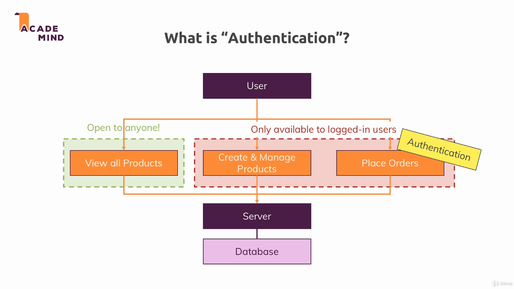
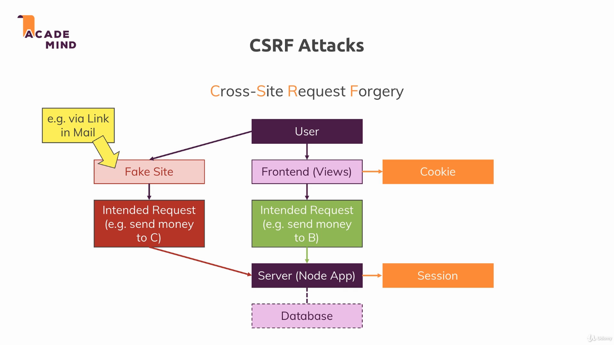

### Authentication

In this module we will create the authentication system for the project, using the concept of session studied before.

To run the example, install dependencies with `npm install`, and run the project with `npm start`. The applications uses the port 3000.

---

---

---

---

---

* [Bcrypt docs](https://github.com/dcodeIO/bcrypt.js)

* [CSRF Attacks](https://www.acunetix.com/websitesecurity/csrf-attacks/)