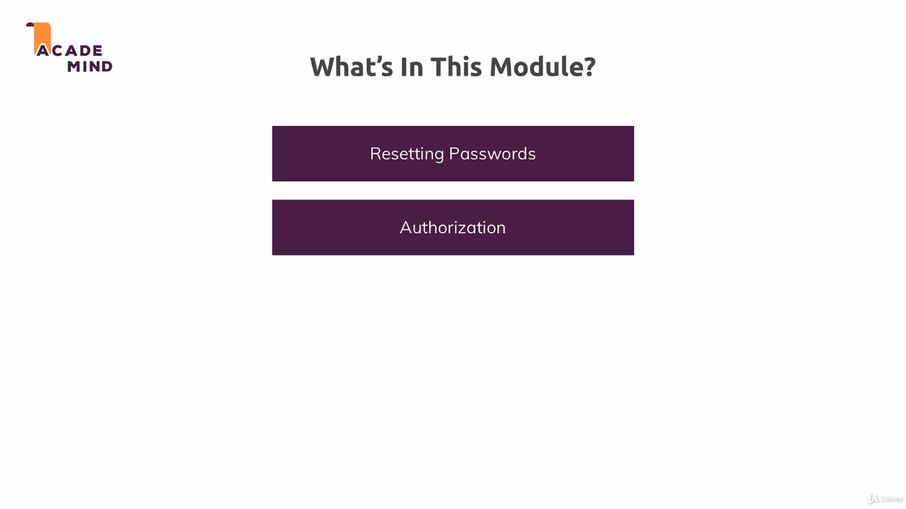
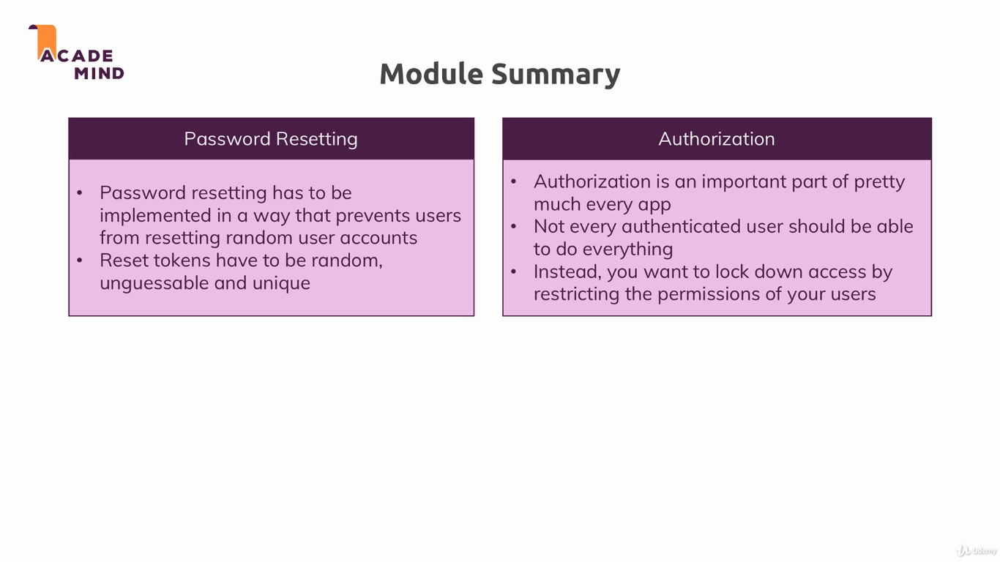

### Advanced Authentication: Password Reseting and Authorization

In this module we implemented password resenting, by sending a password reset token by email to the user, and authorization, to prevend unauthorized users to modify and delete products.

To run the example, install dependencies with `npm install`, and run the project with `npm start`. The applications uses the port 3000.

---

---

