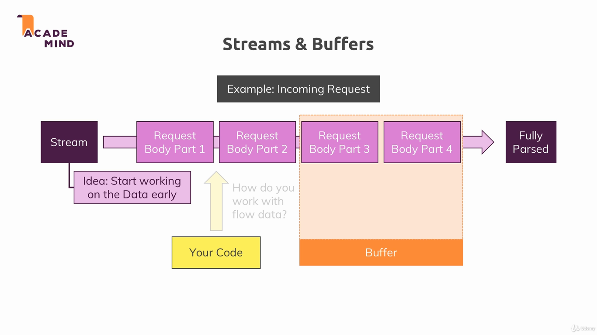
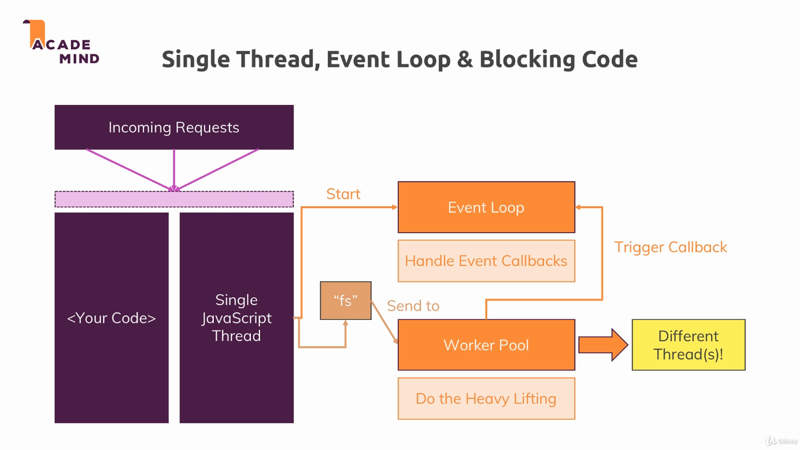
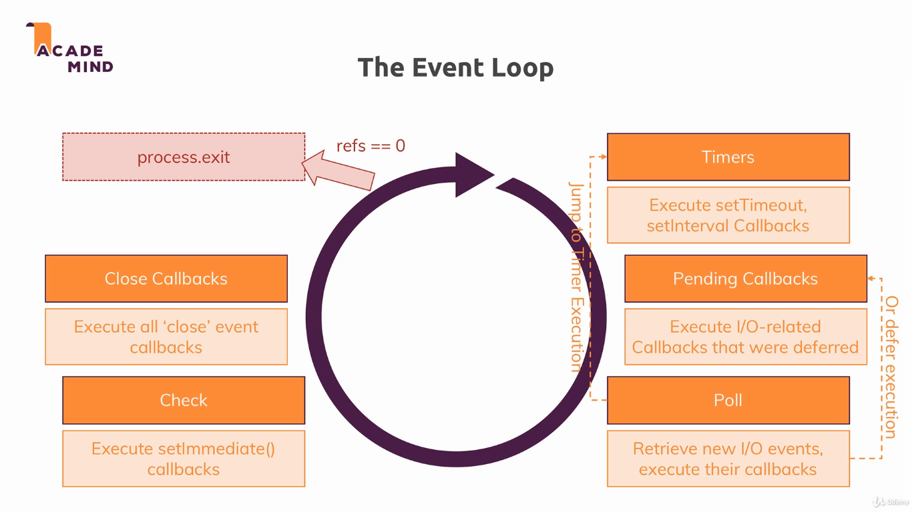
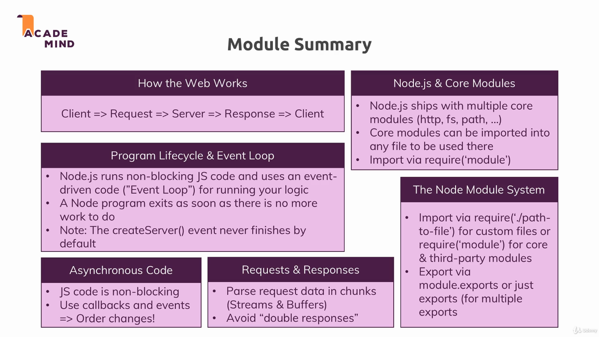

### Basics of Node

This module contains some of the basics of Node.js, without using any modern packages.

To run the example, simply use `node app.js`. Go to [localhost:3000](localhost:3000) in your browser, type something on the text box and press the button to write your message into `message.txt`.

---

The following article provides a great overview of available headers and their role: https://developer.mozilla.org/en-US/docs/Web/HTTP/Headers

---

We handle this using an event listener, e.g. `req.on()`.

---

---

