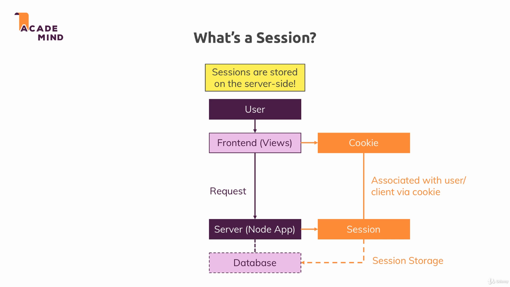

### Cookies

An HTTP cookie is a small piece of data stored on the user's computer by the web browser while browsing a website [[1]](https://en.wikipedia.org/wiki/HTTP_cookie). In this module, we use it with sections to create a simple login system for our website.

To run the example, install dependencies with `npm install`, and run the project with `npm start`. The applications uses the port 3000.

---

---

---

---

---

Useful links:

* [Sessions](https://www.quora.com/What-is-a-session-in-a-Web-Application)
* [Cookies](https://developer.mozilla.org/en-US/docs/Web/HTTP/Cookies)
* [Express-session docs](https://github.com/expressjs/session)