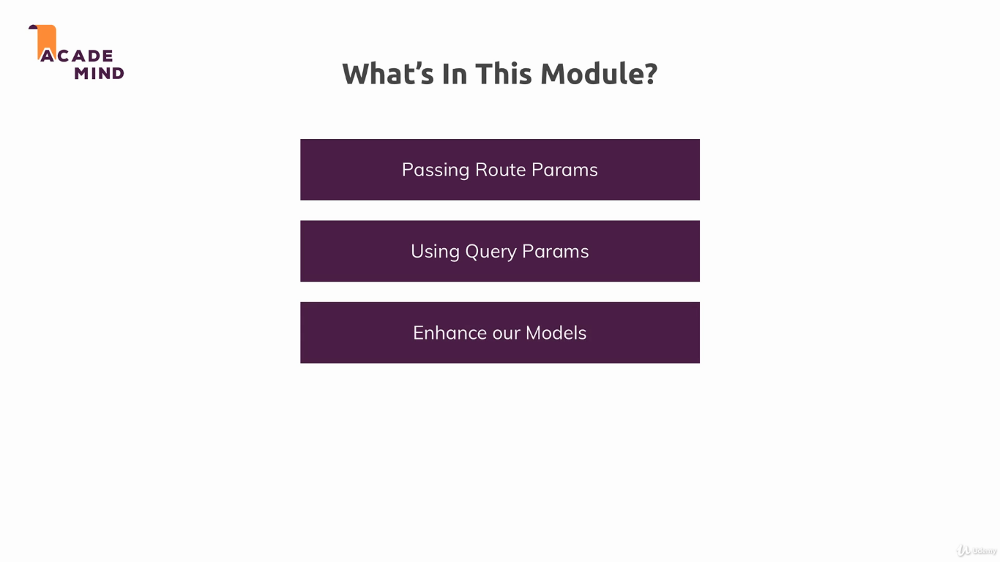
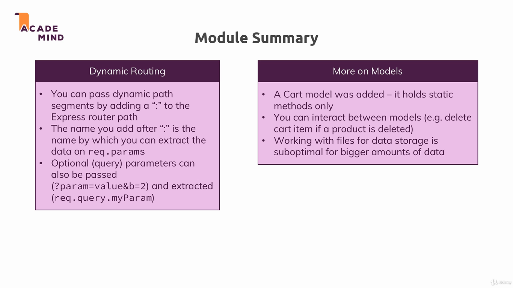

### Dynamic Routes

In this module we learned how to pass information through routes, using query and params.

To run the example, install dependencies with `npm install`, and run the project with `npm start`. The applications uses the port 3000.

---

---

