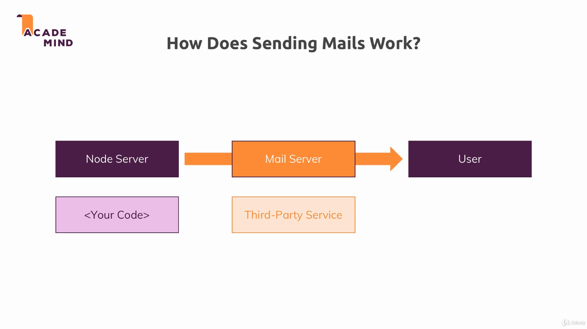

### Cookies

In this module, we leaned how to send emails using a third party email service provider.

To run the example, install dependencies with `npm install`, and run the project with `npm start`. The applications uses the port 3000.

---

---

Useful links:

* [Nodemailer docs](https://nodemailer.com/about/)
* [Sendgrid docs](https://sendgrid.com/docs/)
