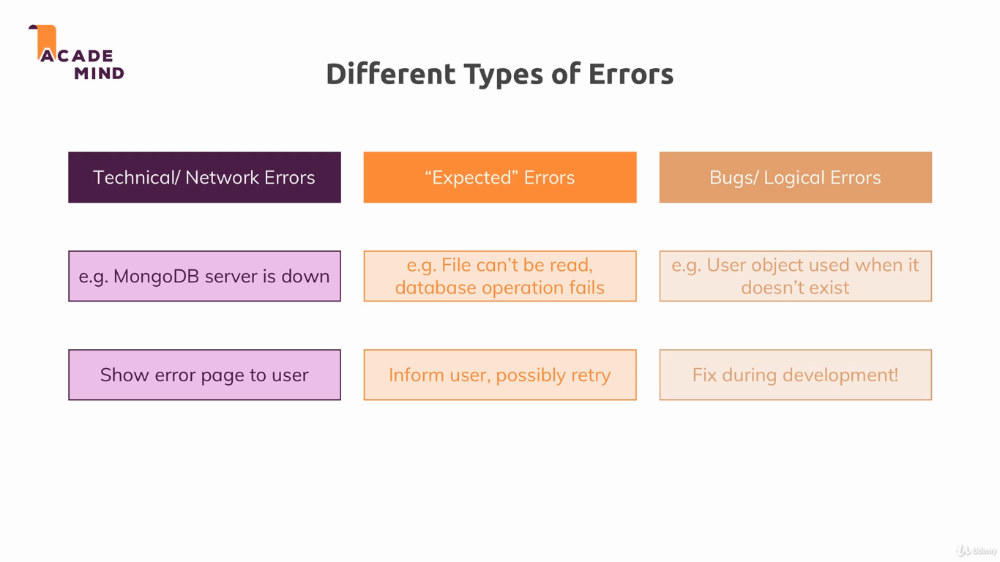

### Error handling

In this module we leaned how to handle the most common type of errors.

To run the example, install dependencies with `npm install`, and run the project with `npm start`. The applications uses the port 3000.

---

---

---

---

---

Useful links:

* [Error handling in Express.js](https://expressjs.com/en/guide/error-handling.html)
* [Status Codes docs](https://developer.mozilla.org/en-US/docs/Web/HTTP/Status)
