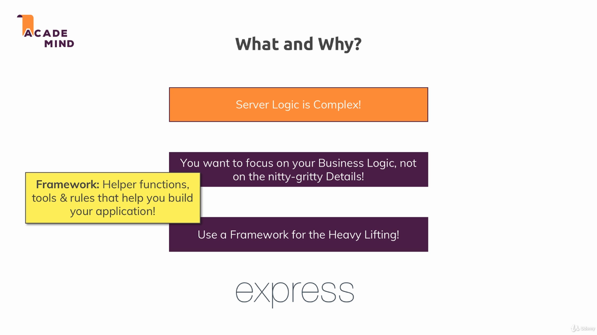
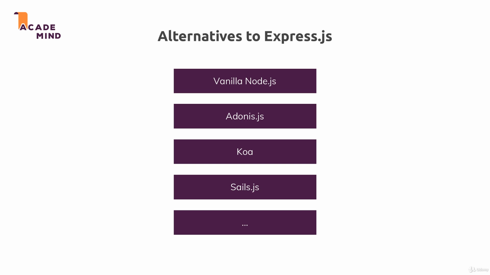
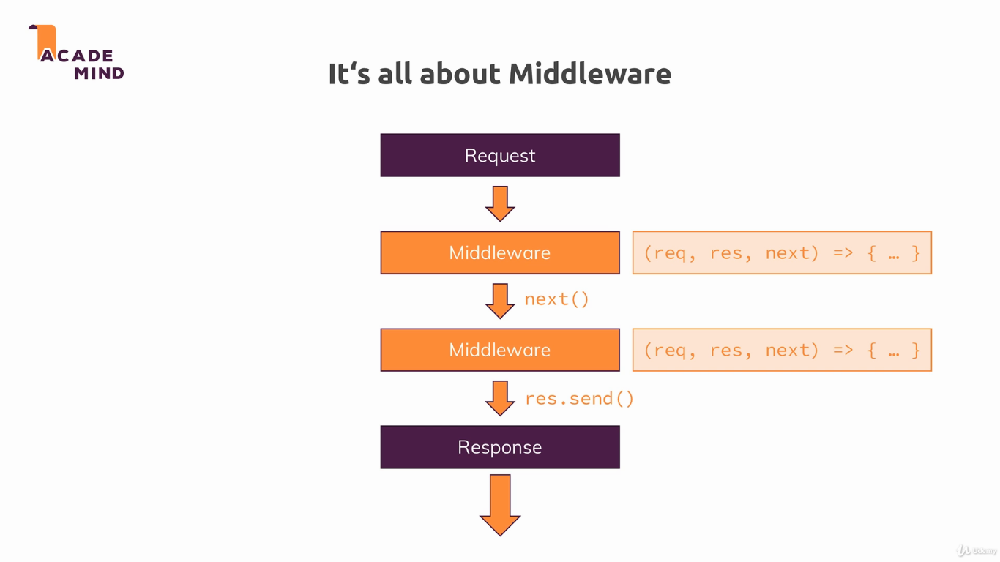
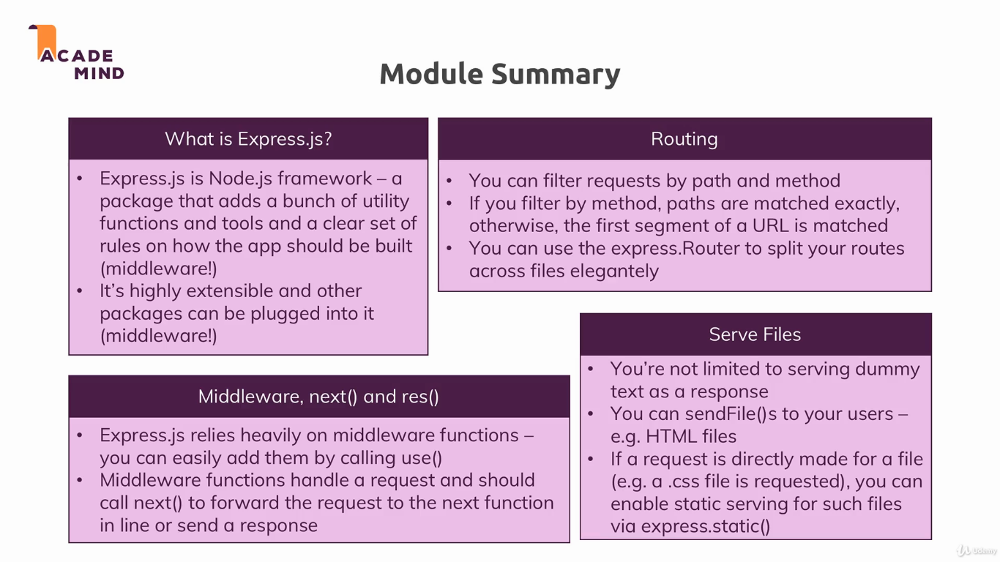

## Express.js

This module introduces the Express framework. Express is a minimal and flexible Node.js web application framework that provides a robust set of features for web and mobile applications [[1]](https://expressjs.com/).

To run the example, install dependencies with `npm install`, and run the project with `npm start`. The applications uses the port 3000.

---

---

---

