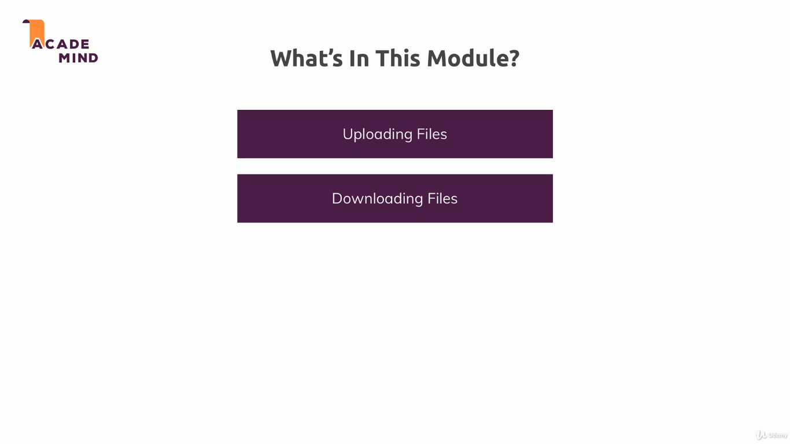

### Download and Upload Files

In this module we learned how to handle download and upload inside your application, getting files input from the users and generating and serving files too.

To run the example, install dependencies with `npm install`, and run the project with `npm start`. The applications uses the port 3000.

---

---

Useful links:

* [Multer docs](https://github.com/expressjs/multer)
* [PDFKit](http://pdfkit.org/docs/getting_started.html)
