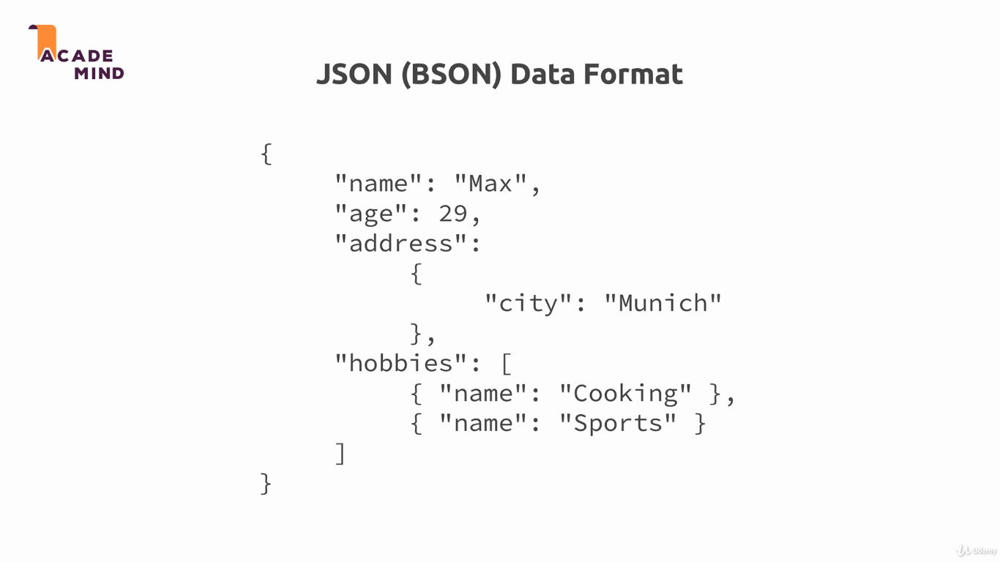
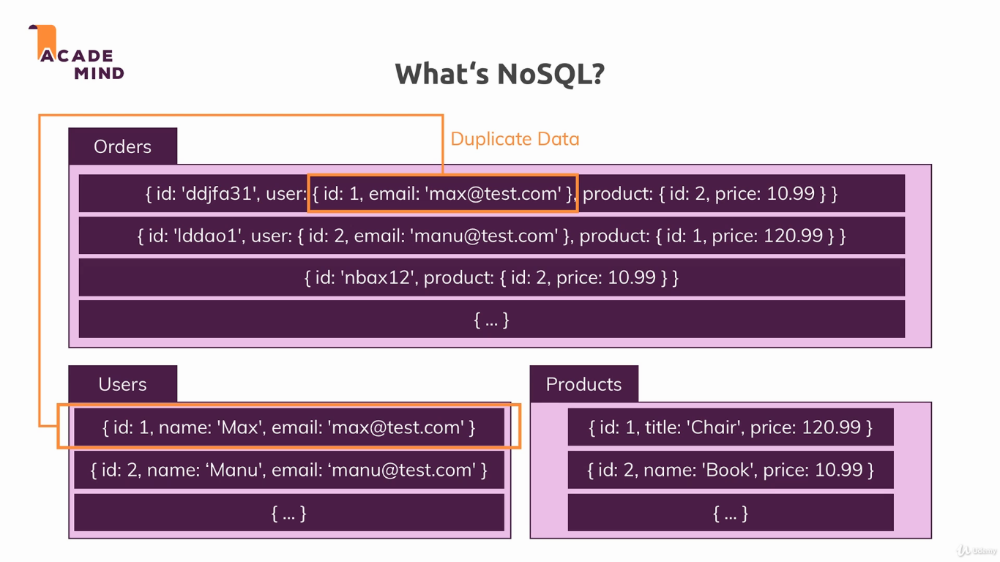
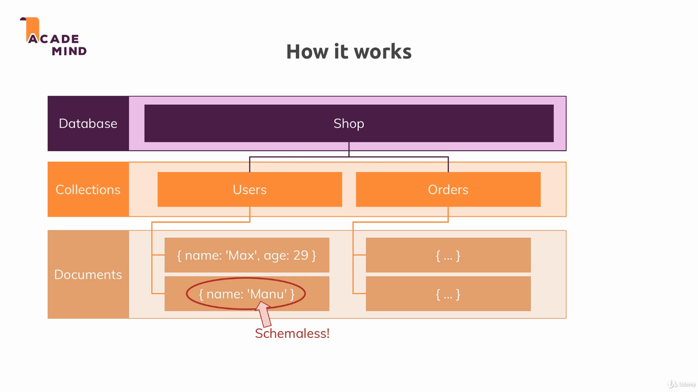
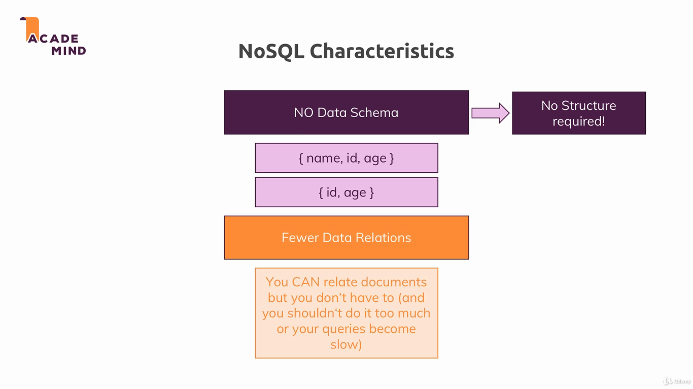
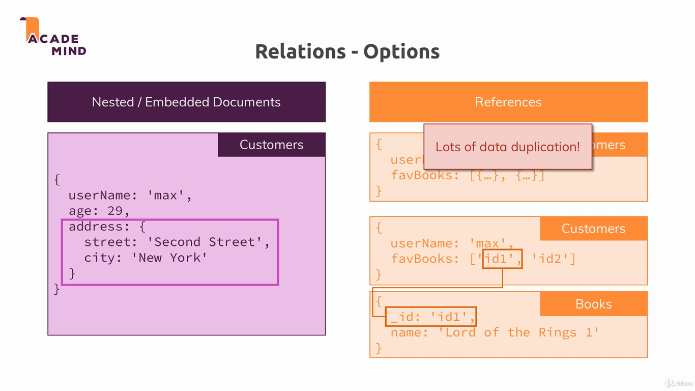
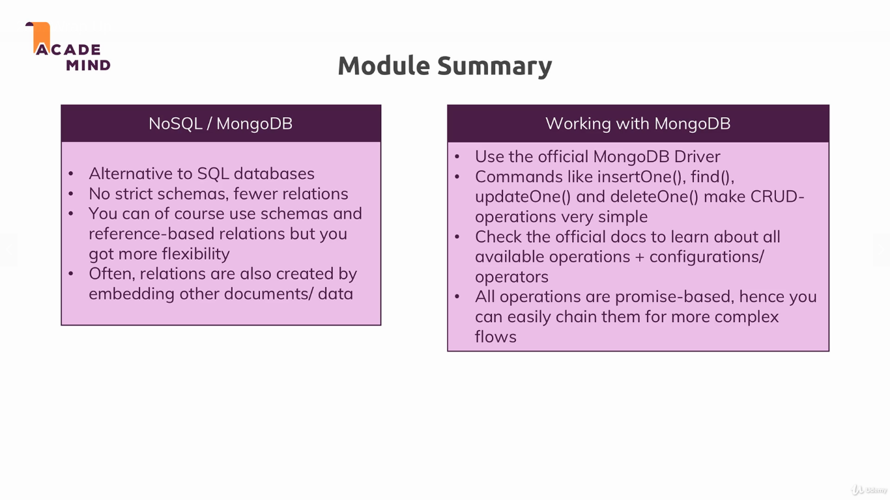

## MongoDB

In this module we changed our database from the Posgres (SQL) to MongoDB (NoSQL).

To run the example, install dependencies with `npm install`, and run the project with `npm start`. The applications uses the port 3000.

---

---

---

---

