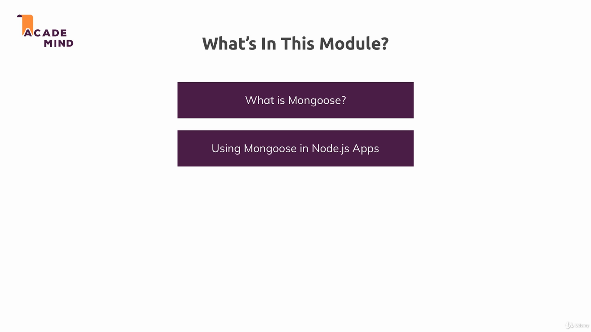
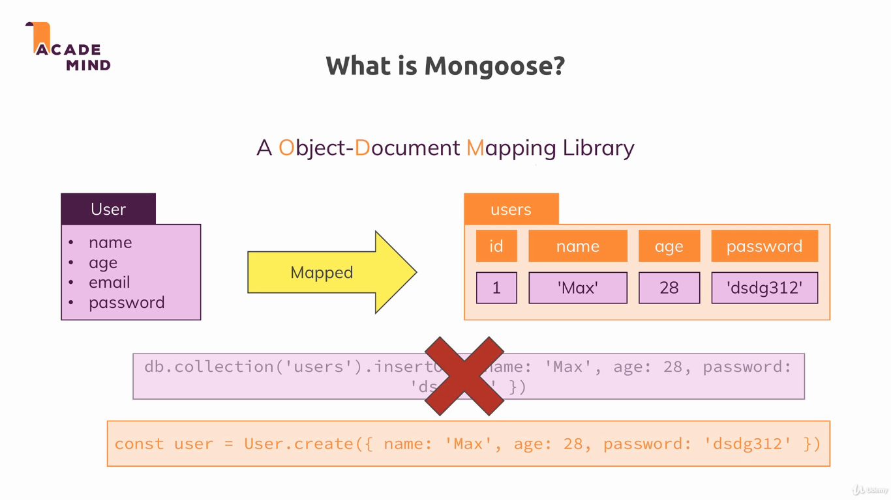
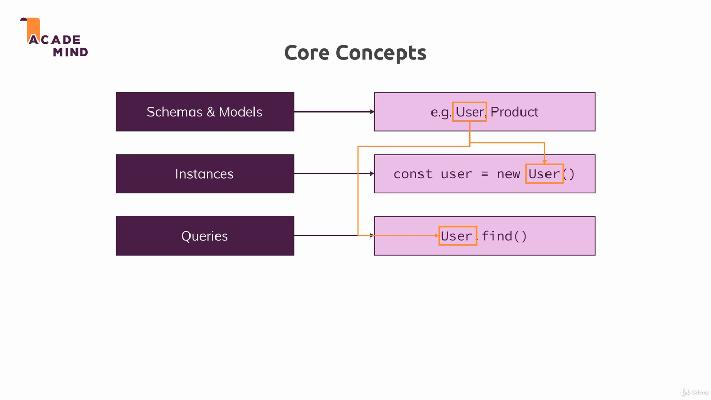

## MongoDB

Mongoose is a MongoDB object modeling tool designed to work in an asynchronous environment [[1]](https://www.npmjs.com/package/mongoose).

To run the example, install dependencies with `npm install`, and run the project with `npm start`. The applications uses the port 3000.

---

---

---
