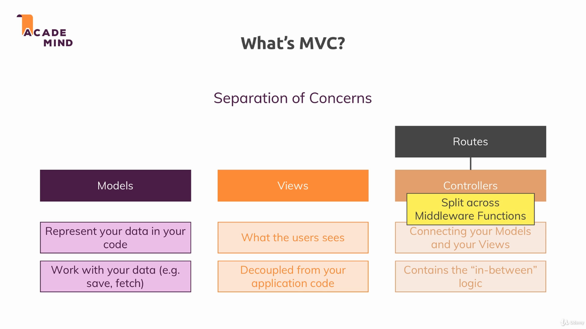
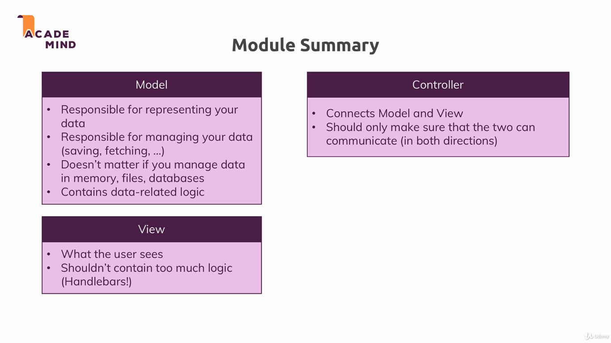

### MVC

This module introduces the concept of MVC. MVC (Model–view–controller) is a software design pattern commonly used for developing user interfaces which divides the related program logic into this three interconnected elements [[1]](https://en.wikipedia.org/wiki/Model%E2%80%93view%E2%80%93controller).

To run the example, install dependencies with `npm install`, and run the project with `npm start`. The applications uses the port 3000.

---

---

