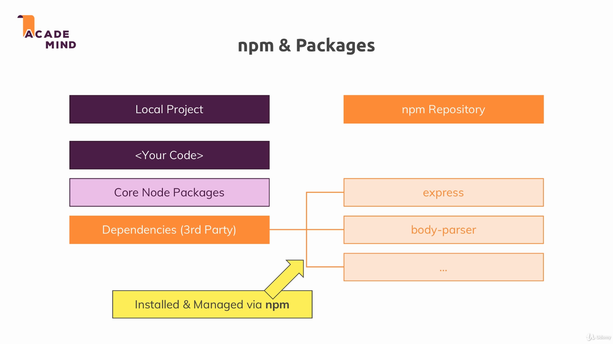
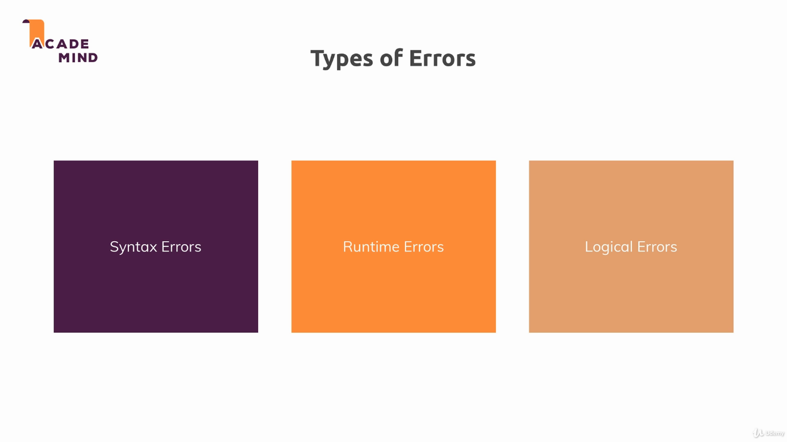
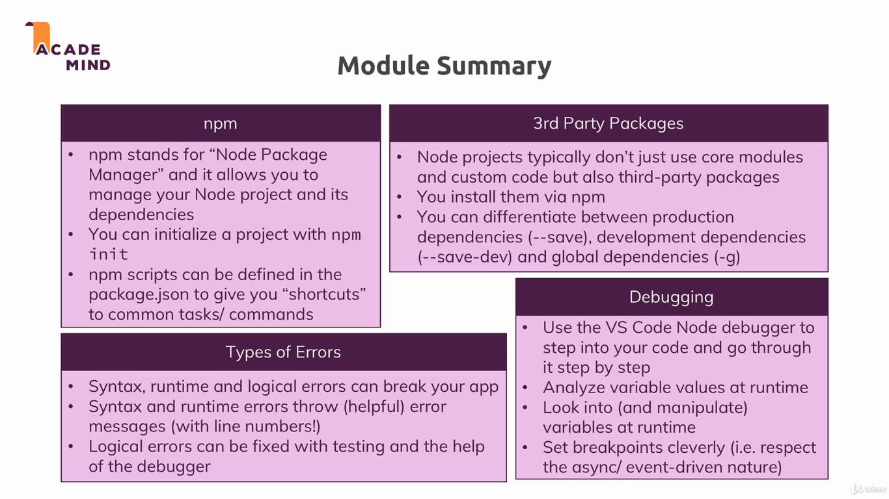

# NPM and Debugging Module

This module is separated in two parts: NPM and Debugging. The first one teaches how to use NPM to handle dependencies, and the second one helps in the process of finding and solving errors.

### NPM - Node Package Manager

---

**Basics**

`npm install` install all the dependencies from the project;
`npm start` run start script defined in `package.json`.

`package.json` contains the project's dependencies, informations and scripts (e.g. testing ones);
`package-lock.json` contains the dependencies exact version used by the dev.

---

Packages can be devided into _dev_ dependencies (used during development) and _production_ dependencies (that will be released with the software).

`npm install <package-name>` flags:

* `--save` install the package as production dependency;
* `--save-dev` install the package as dev dependecy;
* `-g` install the package globally.

---

* **Global features:** Keywords like const or function but also some global objects like process.

* **Core Node.js Modules:** Examples would be the file-system module ("fs"), the path module ("path") or the Http module ("http"). Don't need to be installed, but you need to import them when you want to use features exposed by them.

* **Third-party Modules:** Installed via `npm install` - you can add any kind of feature to your app via this way. Also need to be imported.

---

NPM scripts can run dependencies apps installed. For example `"start": "nodemon app.js"`. Specifically the `-g` flag ensures that the package gets added as a global package which can be used directle from the terminal.

---

### Debugging

Debugging Node.js in Visual Studio Code: [Article](https://code.visualstudio.com/docs/nodejs/nodejs-debugging).

---

