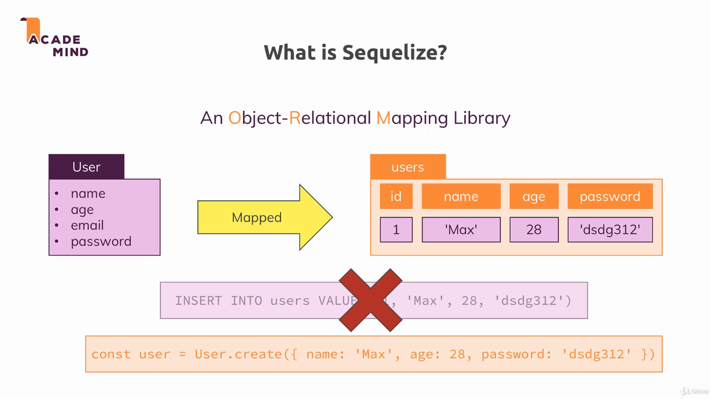
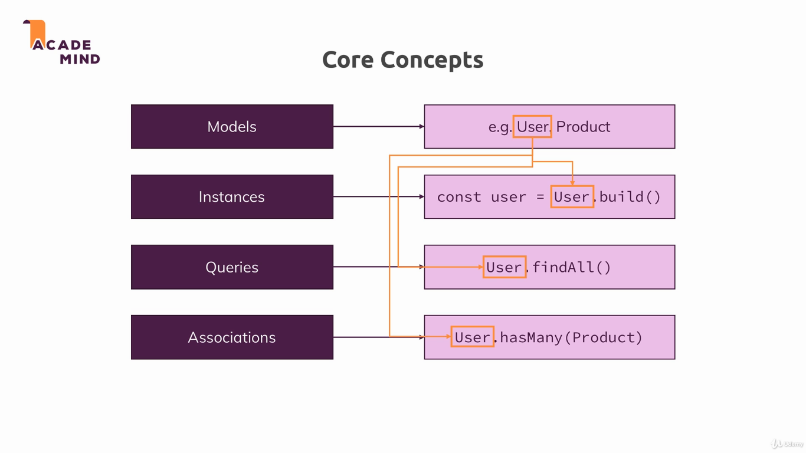
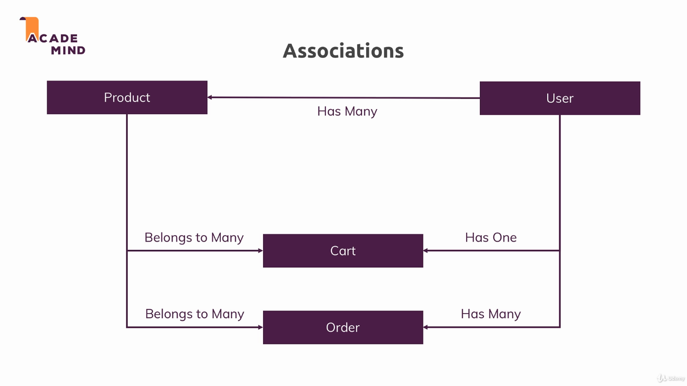
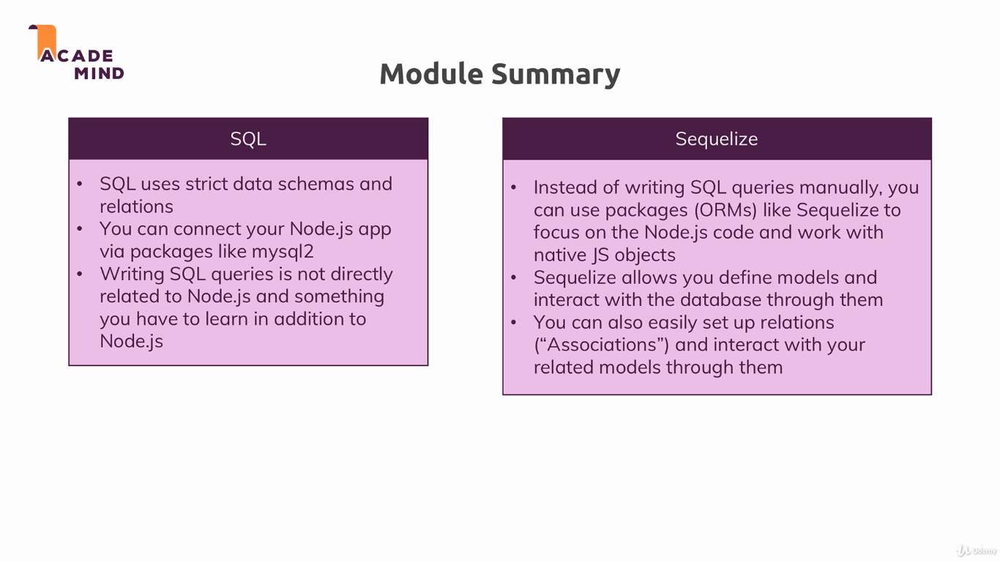

## Sequelize

This module introduce the concept of ORM. Object-relational mapping (ORM) is a programming technique for converting data between incompatible type systems using object-oriented programming languages. This creates, in effect, a "virtual object database" that can be used from within the programming language [[1]](https://en.wikipedia.org/wiki/Object-relational_mapping). The ORM used in this project is Sequelize.

In the original version the database used was MySQL, but I changed it to PostgresSQL. Once we are using an ORM, the code didn't need to be changed, it was only necessary to add the `pg` package. 

To run the example, install dependencies with `npm install`, and run the project with `npm start`. The applications uses the port 3000.

---

---

---

---

* [Sequelize Official Docs](http://docs.sequelizejs.com/)