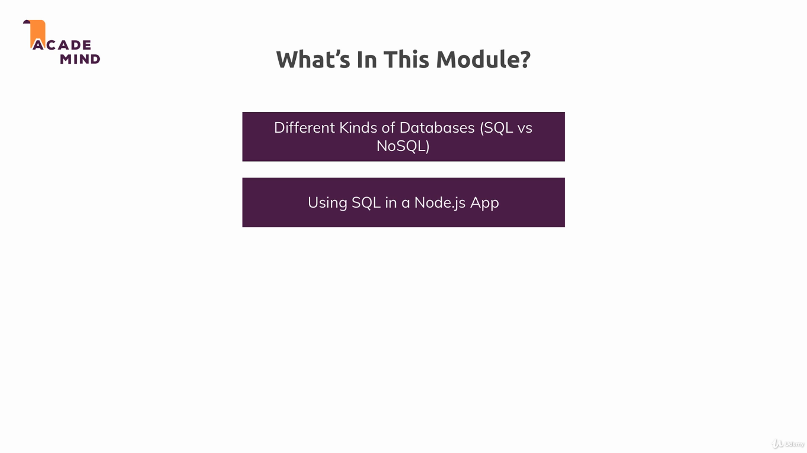
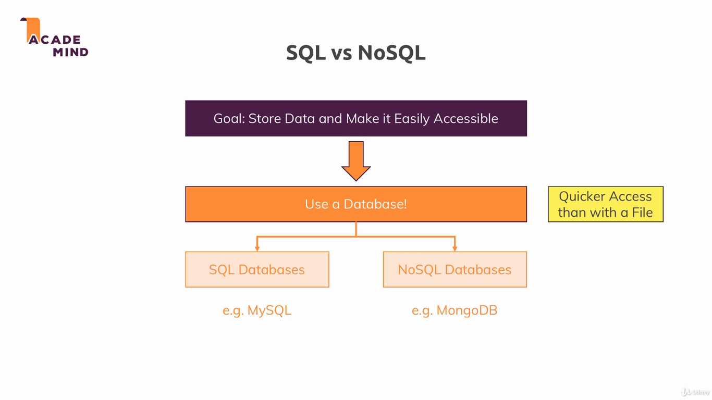
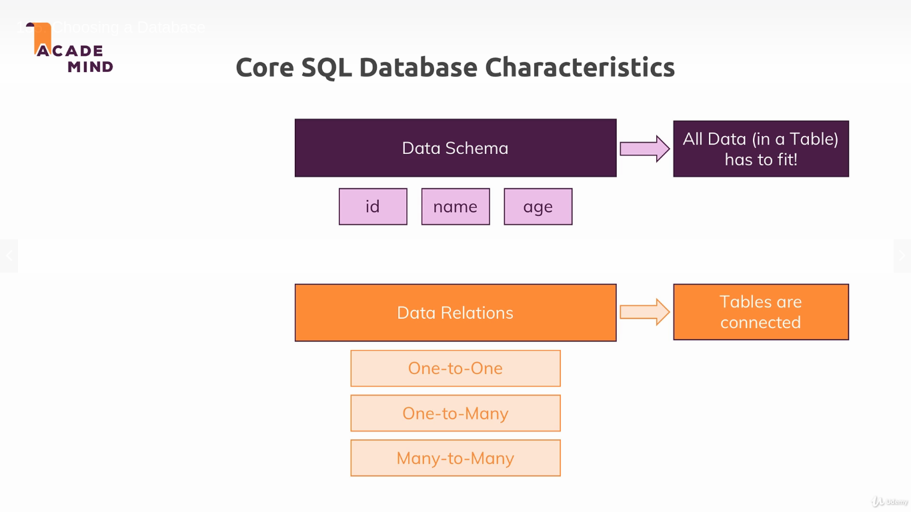
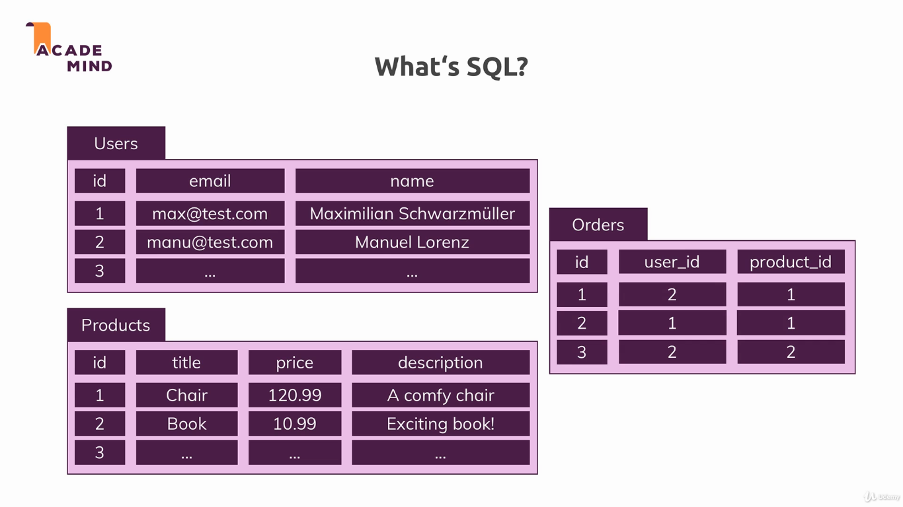
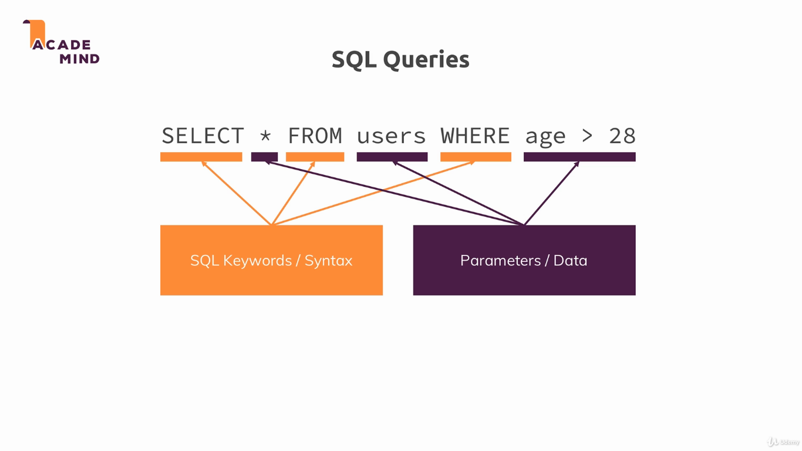
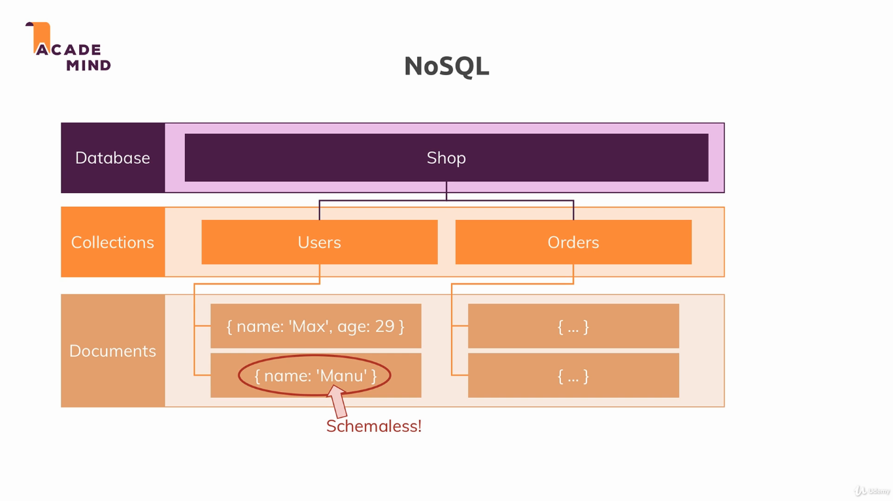
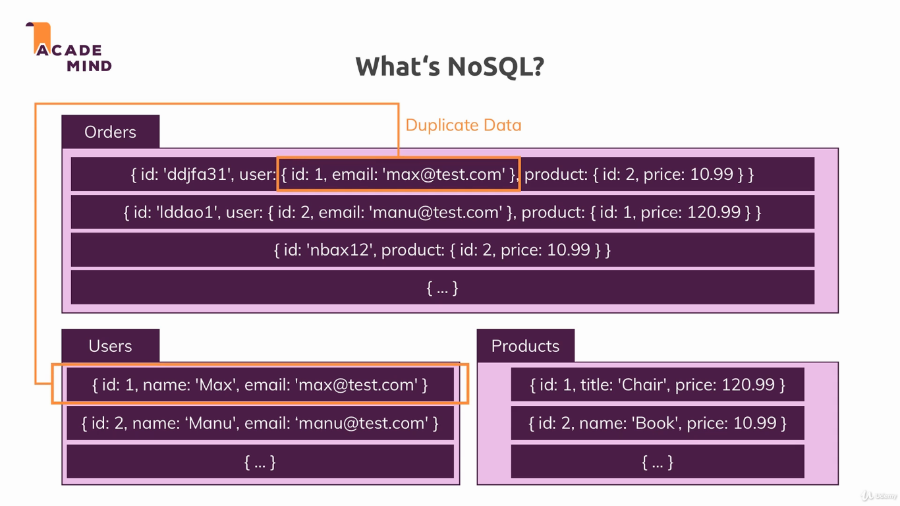
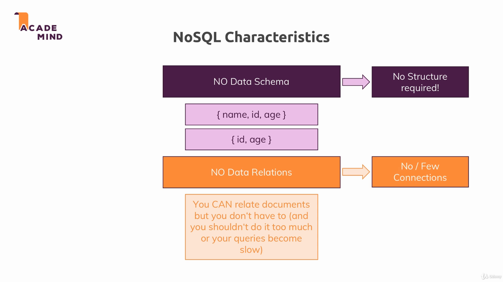
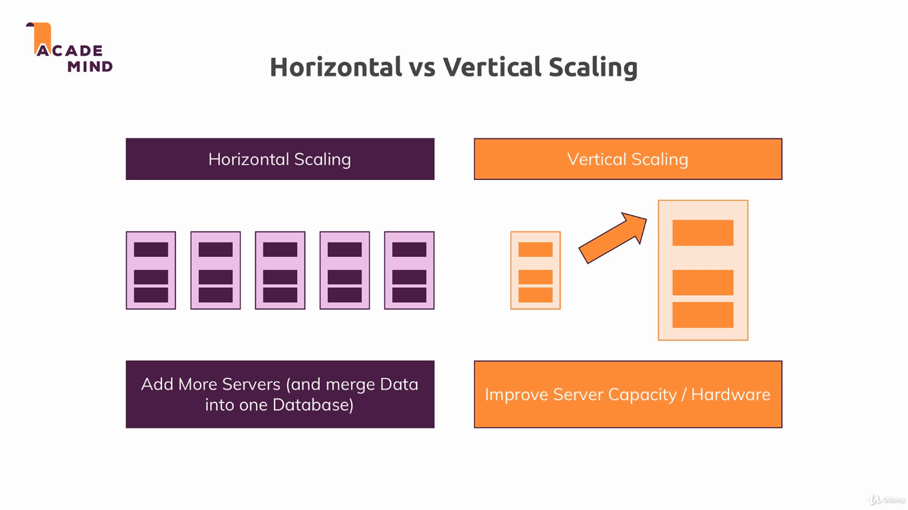
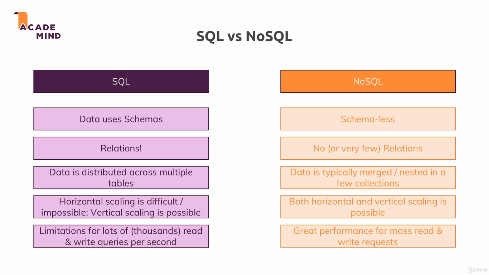

### SQL

In this module we learned the basics of SQL, the differences of SQL and NoSQL and when to use each type of database.

To run the example, install dependencies with `npm install`, and run the project with `npm start`. The applications uses the port 3000.

---

---

---

---

---

Useful resource:

* Learn more about MySQL/ SQL in General: https://www.w3schools.com/sql/

* Learn more about the Node MySQL Package: https://github.com/sidorares/node-mysql2