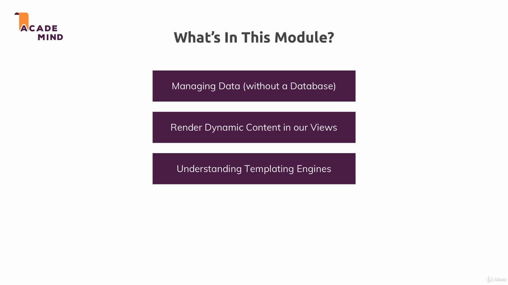
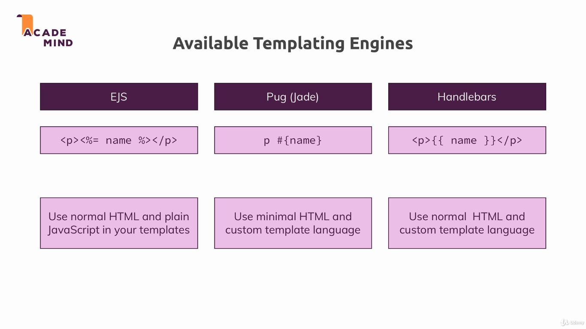

### Template Engines

This module introduces the concept of templating engines, presenting three different ones. A template engine is software designed to combine templates with a data model to produce result documents.

---

---

