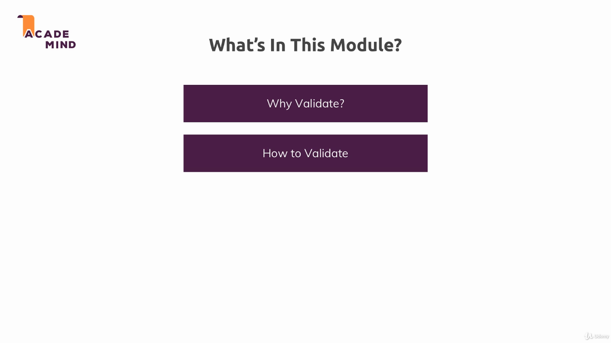
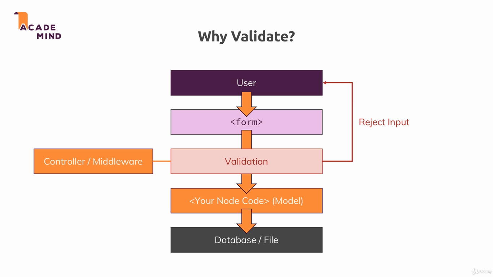
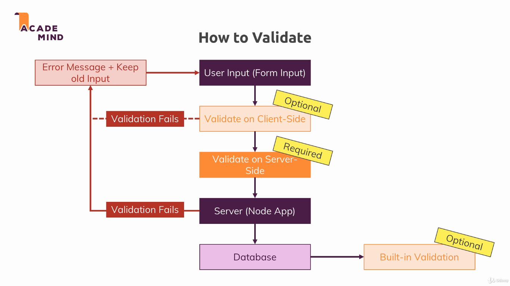

### Validation

In this module we added data validation and sanitization to the project. Validation is the process of verifying if the input data is correct, given the rules of quality we defined, and sanitization is the process of cleaning up data before storing it on the database.

To run the example, install dependencies with `npm install`, and run the project with `npm start`. The applications uses the port 3000.

---

---

---

Useful links:

* [Express-validator docs](https://express-validator.github.io/docs/)
* [Validator.js](https://github.com/chriso/validator.js)
